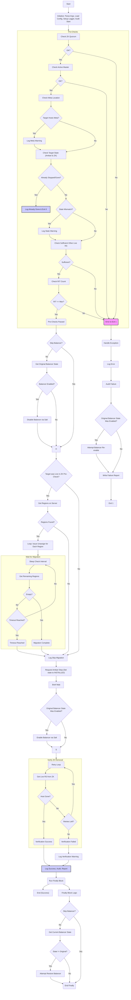

```mermaid
graph TD
    A[Start] --> B(Initialize: Parse Args, Load Config, Setup Logger, Audit Start);
    B --> C{Pre-Checks};

    subgraph C [Pre-Checks]
        direction TB
        C1[Check ZK Quorum] --> C2{OK?};
        C2 -- Yes --> C3[Check Active Master];
        C3 --> C4{OK?};
        C4 -- Yes --> C5[Check Meta Location];
        C5 --> C6{Target Hosts Meta?};
        C6 -- Yes --> C7[Log Meta Warning];
        C8["Check Target State (Ambari & ZK)"];
        C6 -- No --> C8;
        C7 --> C8;
        C8 --> C9{Already Stopped/Gone?};
        C9 -- Yes --> SUCCESS[Log Already Done & Exit 0];
        C9 -- No --> C10{State Mismatch?};
        C10 -- Yes --> C11[Log State Warning];
        C10 -- No --> C12;
        C11 --> C12[Check Sufficient Other Live RS];
        C12 --> C13{Sufficient?};
        C13 -- Yes --> C14[Check RIT Count];
        C14 --> C15{RIT <= Max?};
        C15 -- Yes --> C_OUT(Pre-Checks Passed);
        C2 -- No --> ERROR(Error & Exit 1);
        C4 -- No --> ERROR;
        C13 -- No --> ERROR;
        C15 -- No --> ERROR;
    end

    C_OUT --> D{Skip Balancer?};
    D -- No --> E[Get Original Balancer State];
    E --> F{Balancer Enabled?};
    F -- Yes --> G[Disable Balancer via Salt];
    F -- No --> H;
    G --> H;
    D -- Yes --> H;

    H --> I{Target was Live in ZK Pre-Check?};
    I -- Yes --> J[Get Regions on Server];
    J --> K{Regions Found?};
    K -- Yes --> L[Loop: Issue Unassign for Each Region];
    L --> M["Wait Loop (Max Wait Time)"];
    
    subgraph M [Wait for Migration]
        direction TB
        M1[Sleep Check Interval] --> M2[Get Remaining Regions];
        M2 --> M3{Empty?};
        M3 -- No --> M4{Timeout Reached?};
        M4 -- No --> M1;
        M3 -- Yes --> M_OUT1(Migration Complete);
        M4 -- Yes --> M_OUT2(Timeout Reached);
    end

    M_OUT1 --> N;
    M_OUT2 --> N[Log Timeout Warning];
    K -- No --> N;
    I -- No --> N[Log Skip Migration];

    N --> O["Request Ambari Stop (Set state to INSTALLED)"];
    O --> P[Brief Wait];

    P --> Q{Original Balancer State Was Enabled?};
    Q -- Yes --> R[Enable Balancer via Salt];
    Q -- No --> S;
    R --> S;

    S --> T["Post-Check: Verify ZK Removal"];
    subgraph T [Verify ZK Removal]
        direction TB
        T1[Retry Loop] --> T2[Get Live RS from ZK];
        T2 --> T3{Host Gone?};
        T3 -- Yes --> T_OUT1(Verification Success);
        T3 -- No --> T4{Retries Left?};
        T4 -- Yes --> T1;
        T4 -- No --> T_OUT2(Verification Failed);
    end

    T_OUT1 --> SUCCESS_FINAL[Log Success, Audit, Report];
    T_OUT2 --> U[Log Verification Warning];
    U --> SUCCESS_FINAL;

    SUCCESS_FINAL --> V(Run Finally Block);
    V --> Z["End (Success)"];

    ERROR --> X(Handle Exception);
    X --> X1[Log Error];
    X1 --> X2[Audit Failure];
    X2 --> X3{Original Balancer State Was Enabled?};
    X3 -- Yes --> X4[Attempt Balancer Re-enable];
    X3 -- No --> X5;
    X4 --> X5[Write Failure Report];
    X5 --> X6[Exit 1];

    FINALLY[Finally Block Logic] --> FIN1{Skip Balancer?};
    FIN1 -- No --> FIN2[Get Current Balancer State];
    FIN2 --> FIN3{State != Original?};
    FIN3 -- Yes --> FIN4[Attempt Restore Balancer];
    FIN3 -- No --> FIN_OUT;
    FIN4 --> FIN_OUT;
    FIN1 -- Yes --> FIN_OUT(End Finally);

    %% Link the main flow to Finally block just before ending
    V --> FINALLY;
    %% Link error handling to Finally block if needed (though exit happens before)

    %% Style Adjustments (Optional)
    style ERROR fill:#f9f,stroke:#333,stroke-width:2px
    style SUCCESS fill:#ccf,stroke:#333,stroke-width:2px
    style SUCCESS_FINAL fill:#ccf,stroke:#333,stroke-width:2px
```