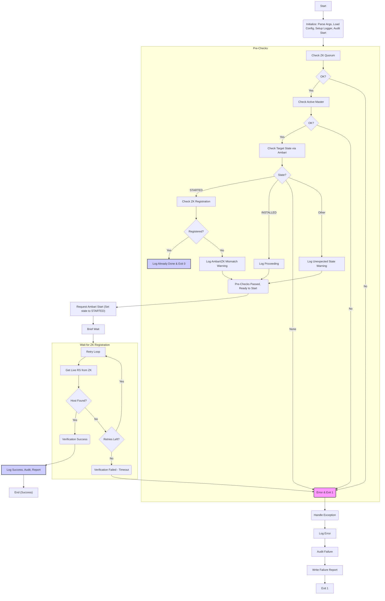

```mermaid
graph TD
    A[Start] --> B(Initialize: Parse Args, Load Config, Setup Logger, Audit Start);
    B --> C{Pre-Checks};

    subgraph C [Pre-Checks]
        direction TB
        C1[Check ZK Quorum] --> C2{OK?};
        C2 -- Yes --> C3[Check Active Master];
        C3 --> C4{OK?};
        C4 -- Yes --> C5[Check Target State via Ambari];
        C5 --> C6{State?};
        C6 -- STARTED --> C7[Check ZK Registration];
        C7 --> C8{Registered?};
        C8 -- Yes --> SUCCESS_EARLY[Log Already Done & Exit 0];
        C8 -- No --> C9[Log Ambari/ZK Mismatch Warning];
        C6 -- INSTALLED --> C10[Log Proceeding];
        C6 -- None --> ERROR(Error: Component Not Found & Exit 1);
        C6 -- Other --> C11[Log Unexpected State Warning];
        C9 --> C_OUT(Pre-Checks Passed, Ready to Start);
        C10 --> C_OUT;
        C11 --> C_OUT;
        C2 -- No --> ERROR(Error & Exit 1);
        C4 -- No --> ERROR;
    end

    C_OUT --> D["Request Ambari Start (Set state to STARTED)"];
    D --> E[Brief Wait];

    E --> F[Wait for ZK Registration];
    subgraph F [Wait for ZK Registration]
        direction TB
        F1[Retry Loop] --> F2[Get Live RS from ZK];
        F2 --> F3{Host Found?};
        F3 -- Yes --> F_OUT1(Verification Success);
        F3 -- No --> F4{Retries Left?};
        F4 -- Yes --> F1;
        F4 -- No --> F_OUT2(Verification Failed - Timeout);
    end
    F_OUT1 --> SUCCESS_FINAL[Log Success, Audit, Report];
    F_OUT2 --> ERROR; 

    SUCCESS_FINAL --> Z["End (Success)"];

    ERROR --> X(Handle Exception);
    X --> X1[Log Error];
    X1 --> X2[Audit Failure];
    X2 --> X3[Write Failure Report];
    X3 --> X4[Exit 1];

    %% Style Adjustments (Optional)
    style ERROR fill:#f9f,stroke:#333,stroke-width:2px
    style SUCCESS_EARLY fill:#ccf,stroke:#333,stroke-width:2px
    style SUCCESS_FINAL fill:#ccf,stroke:#333,stroke-width:2px
```